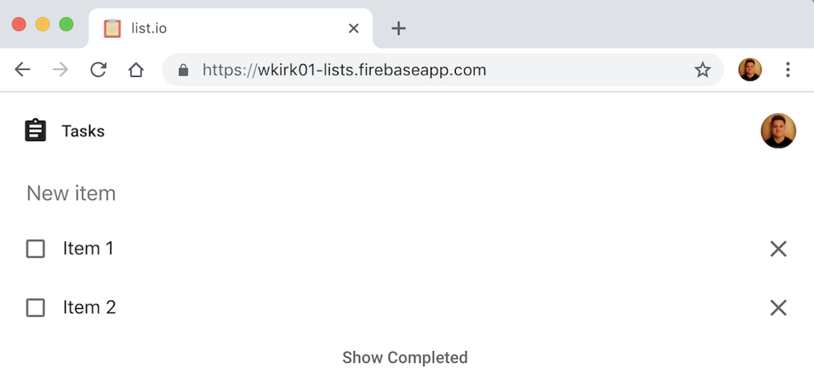

# [Lists](https://wkirk01-lists.firebaseapp.com/)

Simple list app built with Angular. 

Leverages these frameworks:
* [Angular Material](https://material.angular.io/)
* [UIkit](https://getuikit.com/docs/introduction)
* [Cloud Firestore](https://firebase.google.com/docs/firestore/)
* [Firebase Cloud Functions](https://firebase.google.com/docs/functions/)
* [Electron](https://electronjs.org/) (for desktop client)